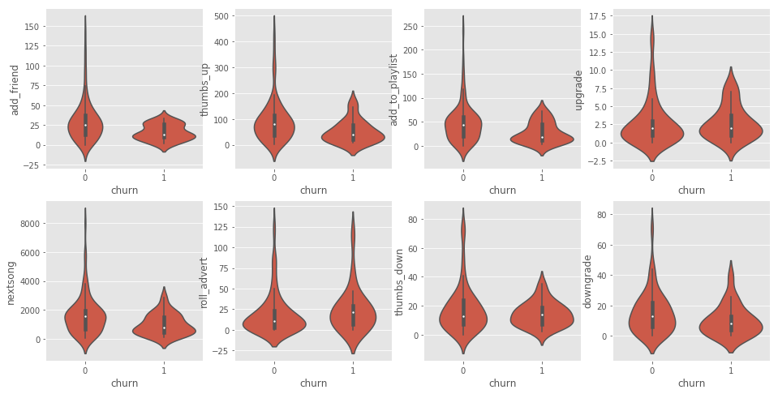

# 客户流失预测Sparkify 项目
根据音乐类服务的用户行为数据集，该数据集采用的音乐项目的用户使用过程中的数据，诸如性别、等级以及听歌、点赞、添加朋友、加入播放列表等行为日志。对数据进行清洗、探索性分析并利用机器学习算法进行可能的客户流失的预测。

## 数据结构

数据共有286500条数据，包含如下特征：

- userId:用户ID
- sessionId:会话ID

- artist：歌手

- auth:登录状态，可能的取值为Logged Out,Cancelled,Guest,Logged In

- gender:性别，可能的取值为F和M

- level:会员等级，可能的取值为free和paid

- page:请求页面，可能的取值为

  - Cancel：取消
  - Submit Downgrade：提交降级
  - Thumbs Down：鄙夷
  - Home：查看主页
  - Roll Advert：滚动广告
  - Logout：退出
  - Save Settings：保存设置
  - Cancellation Confirmation：确定取消
  - About：关于
  - Submit Registration：提交注册
  - Settings：设置
  - Login：登录
  - Register：注册
  - Add to Playlist：添加至播放列表
  - Add Friend：添加好友
  - NextSong：下一曲
  - Thumbs Up：点赞
  - Help：求助
  - Upgrade：查看升级

- registration:注册时间

- song:歌名

- status:可能取值为202，400，307

- ts:时间

- userAgent:用户使用设备

# 加载和清洗数据

数据集是`json`格式，加载和清洗数据集，检查是否有无效或缺失数据——例如，没有`userid`或`sessionid`的数据。 

### 质量问题：
- `userId`中存在空值，删除`userId`为空的数据
- `registration`和`ts`数据类型应该是时间
- `userAgent`代表了用户使用的设备，可以提取设备信息

# 探索性数据分析

### 定义客户流失

完成初步分析之后，创建一列 `Churn` 作为模型的标签。使用 `Cancellation Confirmation` 事件来定义客户流失，该事件在付费或免费客户身上都有发生。

### 探索数据
定义好客户流失后，执行一些探索性数据分析，观察留存用户和流失用户的行为。把这两类用户的数据聚合到一起，观察固定时间内某个特定动作出现的次数或者播放音乐的数量。

### 提出问题

- 观察流失用户的数量分布和相关因素间关系
    - 留存用户和流失用户占比
    - 流失用户和Level、gender、device间的关系  
- 观察流失用户的特定动作出现的数量之间的关系
    - Next Song，Thumbs Down，Thumbs Up，Roll Advert、Downgrade、Add Friend、Add to Playlist、Upgrade等动过出现的次数
    - 听过的歌曲数目、听过的艺术家的数目

#### 观察流失用户的数量分布和相关因素间关系

##### 留存用户和流失用户占比

##### 流失用户和Ggender间的关系

##### 流失用户和Level间的关系

##### 流失用户和Device间的关系

通过上面的图表可以看出：
- 流失用户占比低于留存用户，占比分别为23.11%和76.89%
- 流失用户中男性的绝对人数和比例均大于女性。
- 流失用户中付费用户的绝对数量大于免费用户，而无论是付费还是免费留存用户都占据绝大多数。
- 用户大多数通过Mac和Windows访问，其中使用Windows流失客户的绝对数量最大，其次是Mac，同时使用X11客户中流失客户的比例最高，其次是iPhone。

#### 观察流失用户的特定动作出现的数量之间的关系

- Next Song，Thumbs Down，Thumbs Up，Roll Advert、Downgrade、Add Friend、Add to Playlist、Upgrade等动过出现的次数
- 听过的歌曲数目、听过的艺术家的数目
- 出错次数分布关系

##### 用户操作数分布箱线图

##### 用户听过的艺术家分布关系

##### 出错次数的用户数分布

##### 听歌次数用户数分布

##### 不同的用户操作的次数相关性

通过上图，我们可以观察流失用户的特定动作出现的数量之间的关系：
- 相较于留存用户，发生Add Frind、Thumbs Up、Add to Playlist、NextSong、Thumbs Down动作次数相对较少，且数据分布相对集中，同时Upgrade、Roll Advert、Downgrade的次数差别相对不太明显。
- 相比于留存用户流失用户听的艺术家数和歌曲数目相对较少。
- 出现错误的次数较少，错误次数对留存率没有明显的相关性。
- 从整体上可以看大，流失用户在页面发生动作的次数要低于留存用户，特别地，流失用户发出Next Song、Thumbs UP、Add to Playlist、Add Friend等动作的次数要明显少于留存用户。同时也可以看到产生Next Song动作次数与Add to Playlist、Add Friend、Downgrade动作次数具有明显的正相关性，Thumbs Up动作产生的次数与Add to Playlist、Add Friend、Downgrade动作次数也有明显的正相关性。

# 特征工程

根据上面的分析结果将用户操作取`NextSong`、`Thumbs Down`、`Thumbs Up`、`Roll Advert`、`Downgrade`、`Add Friend`、`Add to Playlist`、`Pgrade`等行为操作次数，以及用户听过的艺术家数以及用户等级(付费或免费)等构建数据特征。同时将churn改名为label作为数据训练的标签。

# 建模

将完整数据集分成训练集、测试集和验证集。选择如下模型

| 机器学习算法 |        参数        |
| :----------: | :----------------: |
|   随机森林   | maxDepth、numTrees |

## 评估指标

可用于分类问题的，可能出现的结果如下：

|          |  Guessed Positive  |  Guessed Negative  |
| :------: | :----------------: | :----------------: |
| Pisitive | True Positive(TP)  | False Negative(FN) |
| Negative | False Positive(FP) | True Negative(TN)  |

### 分类问题评估指标

可以使用的评估指标有：

#### 准确率

$$
准确率 = \frac{TP + TN}{总数}\\
	= \frac{正确分类数}{总数}
$$

当数据呈斜分布时不适用，本数据集中留存客户的占比远大于流失客户，因此不适合做评估指标。

#### 精度(Precision)

$$
精度 = \frac{TP}{TP + FP}
$$

从一定程度上反应了敏感性，衡量了分类器对正例的识别能力。

#### 召回率(Recall)

$$
召回率 = \frac{TP}{TP + FN}
$$

#### F1 Score

$$
F1 Score = 2*\frac{1}{Precision^{-1} + Recall^{-1}} \\
	= 2*\frac{Precision*Recall}{Precision+Recall}
$$

`F1 Socre`是准确度的度量，它结合精确度和召回率综合计算得到的。

#### 确定评估指标

本实验为了预测客户的流失率，目标是尽可能准确地识别出可能流失的客户，可以使用准确率来对模型进行评估。本实验数据集中共有117个客户数据，100个训练数据，8个验证数据，9个测试数据，在上面的数据探索分析中可以看到数据集中留存客户的占比为76.89%，留存客户比例远大于流失客户，数据分布呈斜分布。

在这种情况下，假设天真地预测模型结果均为0(都为留存客户),此时模型的准确率可以接近80%，可见因此精度不适合最评估指标。而采用召回率或者F1 Score更加适合，本数据集中流失客户很少，F1 Score结合精度和召回率，更适合做评估指标.

在训练集上进行模型训练，并在验证集上利用`F1 Score`作为评估参数，进行交叉验证，选择表现好的参数，之后在训练集上进行观察准确率和`F1 Score`表现。

## 模型选择

### 随机森林

利用多棵树对样本进行训练并预测的一种分类器。

#### 调整的参数

- `maxDepth`可能取值有5,10
- `numTrees`可能取值有5, 8

#### 最佳参数

|   参数   |  值  |       说明       |
| :------: | :--: | :--------------: |
| maxDepth |  5   |   树的最大深度   |
| numTrees |  5   | 要训练的树的数量 |

#### 特征重要性

|  请求页面   | 重要程度 |
| :---------: | :------: |
|   Cancel    |  0.6127  |
| Thumbs Down |  0.1337  |
|  Thumbs Up  |  0.0682  |

#### 评估得分

- 准确度：100%
- F-1 Score:01.0
- 训练耗时：1401.13s
- 在测试集上预测耗时：280.81s

### 逻辑回归

#### 调整参数

- maxIter可能取值有3，5

#### 最佳参数

|  参数   |  值  |     说明     |
| :-----: | :--: | :----------: |
| maxIter |  3   | 最大迭代次数 |

#### 评估得分

- 准确度：100%
- F-1 Score:1.0
- 训练耗时：650.36s
- 在测试集上预测耗时：278.59s

### 模型对比

随机森林和逻辑回归在评估指标上的表现都很不错，相较来说逻辑回归训练，会更加倾向于逻辑回归算法。

# 结论

在客户流失预测的项目中，首先收集并读取数据，然后探究数据并找到数据中存在的一些质量问题并对数据进行清洗，之后以Cancellation Confirmation事件定义客户流失，探究流失客户在性别、会员级别和访问页面次数之间的关系并以可视化的方式展示，接下来，根据前面的讨论，选取一些特征如访问`Cancle、Thumbs Down`等页面的次数构建特征，并进行归一化，将用户是否流失作为标签，选取`F1 Score`为评估指标，利用随机森林机器学习算法再训练集上训练并在测试集上查看测试效果。

## 挑战与反思

- 对用户访问页面行为次数为特征，书写了一系列的函数提取相关特征。
- 通过数据探索的方式探究用户一系列行为和客户流失之间的关系。
- 在利用机器学习对客户的行为进行预测时，根据探索性分析结果，只提取了客户的部分行为。

## 待改进

- 实验在完整数据集的子集中进行，可以将算法迁移至12GB数据集进行训练，效果可能会进一步提升。
- 利用其他的机器学习模型如逻辑回归、决策树等模型进行训练，形成对比，根据训练时间、`F1 Score`等指标综合考虑选择选择。

# 参考资料：

- [Covert timestamp to date in spark dataframe](https://stackoverflow.com/questions/45977449/convert-timestamp-to-date-in-spark-dataframe)
- [Pyspark: Difference between two Dates (Cast TimestampType, Datediff)](https://stackoverflow.com/questions/44821206/pyspark-difference-between-two-dates-cast-timestamptype-datediff/44859561)
- [Source code for pyspark.ml.classification](https://spark.apache.org/docs/2.2.0/api/python/_modules/pyspark/ml/classification.html)
- [可视化随机森林的特征重要性](https://blog.csdn.net/wj1298250240/article/details/103654664)